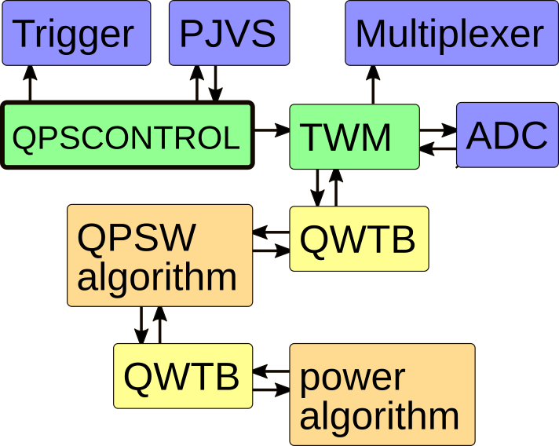

# QPsw - Quantum Power software

Software and documentation for Quantum Power System for measurement of electric power.
Developed in the scope of EMPIR project *19RPT01 QuantumPower - Quantum traceability for AC power standards*.

[http://quantumpower.cmi.cz](http://quantumpower.cmi.cz)

## Scheme of the software

## Links
[QWTB](https://qwtb.github.io/qwtb/)

[TWM](https://github.com/smaslan/TWM)

[TWM builds](https://github.com/smaslan/TWM-builds)

[Document for QPsw](https://docs.google.com/document/d/e/2PACX-1vSt-puA1Wf-ZNfy9iknutrQ3dnUIzEJduiX1uOwK5efcjXYyhUTaYF88qtkRb6krcThQzF1a10YIxMh/pub)

## Status of the project
Yet to do:

Type | Task | status
-----|------|--------
hw | design multiplexer | ✔
hw | produce multiplexer | ✔
hw | check multiplexer errors | partially
sw | make multiplexer driver | ✔
sw | check multiplexer driver | ✔
sw | implement multiplexer driver into TWM | ✔
sw | check multiplexer in TWM | ✔
sw | update QWTB | ✔
sw | update GOLPI to new Matlab and Octave versions | ✔
sw | update GOLPI to LabVIEW 2020 | ✔
sw | update infostrings | ✔
sw | update TWM to LabVIEW 2020 | ✔
sw | improve TWM to handle QPsw | almost finished, postponed for TWM to LV2020 conversion and mutliplexer driver integration
sw | design control QPsw | working on…
sw | make control QPsw | ❌
sw | check control QPsw | ❌
alg | make demultiplexing QPsw algorithm | ✔
alg | test demultiplexing QPsw algorithm | ✔
alg | make ADC calibration algorithm | ✔
alg | test ADC calibration algorithm | ❌
alg | speed up ADC calibration fitting | ❌
alg | make signal simulator | ✔
