# QPSW algorithm
Reorders data based on multiplexer configuration of the QPower System (QPS). Contains QPS simulator.

## Terminology:
- Record: all sampled data.
- Data piece: data sampled by a digitizer from multiplexer switch to another switch.
- Data block: minimal consecutive data pieces needed to perform one measurement.

## Multiplexer configuration
Multiplexer configuration is stored in matrix `M`. Properties:
- Rows of the matrix is equal to number of used digitizers.
- Columns of the matrix are equal to number of data pieces.
- Every element of the matrix is a integer number describing the signal sampled by the actual digitizer in the actual multiplexer state. Negative numbers are quantum signals, positive numbers are DUT (Device Under Test) signals. Zero is no/empty/shorted signal.
Example of `M` showing 3 digitizers, one quantum signal. First digitizer 1 samples DUT signal 1,
digitizer 2 samples quantum signal, digitizer 3 samples DUT signal 2 etc. Every pipe character
represents switch of the multiplexer:

    Data block :        1     |       2      |       3      |
    Data piece :  1 |  2 |  3 |  1 |  2 |  3 |  1 |  2 |  3 |
    Multiplexer configuration:                                   
    digitizer 1:  1 |  2 | -1 |  1 |  2 | -1 |  1 |  2 | -1 |
    digitizer 2: -1 |  1 |  2 | -1 |  1 |  2 | -1 |  1 |  2 |
    digitizer 3:  2 | -1 |  1 |  2 | -1 |  1 |  2 | -1 |  1 |
    Configuration matrix:
    M = [ 1 2 -1 1 2 -1 1 2 -1; -1 1 2 -1 1 2 -1 1 2; 2 -1 1 2 -1 1 2 -1 1];

## Multiplexer switches
Multiplexer switches are represented by row vector `S`. Every element of the vector represents index
of a record sample just after the switch. Proper S vector should start with element equal to 1 (just
after opening switch), and last element have to be euqal to number of samples in record plus one
(last record of the sample is before the last switch).
Example of `S`: `[1 101 201 301]`. The switches happened just before start of the sampling, than
between samples 100 and 101, 200 and 201, and after last sample 300.

## Script process
1. The sampled data are split into individual data pieces.
1. Calibration data (gain, offset) are calculated for all data pieces with quantum signal.
1. Calibration data are assigned to all remaining data pieces (with DUT) in this way:
    1. Calibration data are assigned to all following data pieces of the actual digitizer until next data piece with quantum signal is found.
    1. If data piece is before any available data piece with quantum signal (at the beginning of the
       record), calibration data are asssigned from the first available data piece with quantum
       signal (for the actual digitizer).
1. Data pieces with DUT are recalculated based on the calibration data.
1. For every data piece with DUT selected algorithm is applied.

## Scripts dependency
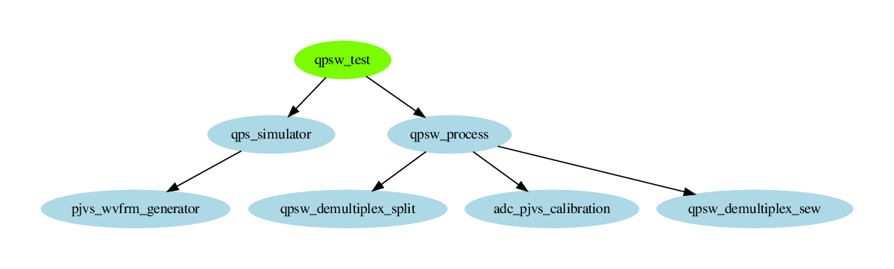

## Available configurations of QPS simulator
Simulator works in following configurations (Signo: number of DUT signals, DACno: number of digitizers, PJVSno: number of quantum signals):

    [Signo DACno PJVSno]
    1: [1 1 1]
    2: [2 1 1]
    3: [2 2 1]
    4: [2 2 1]
    5: [2 3 1]
    6: [6 3 1]

### Simulator configuration 1
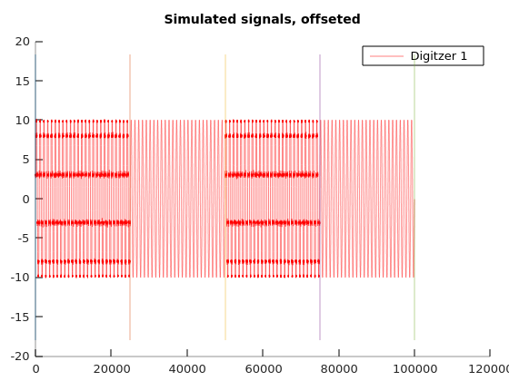
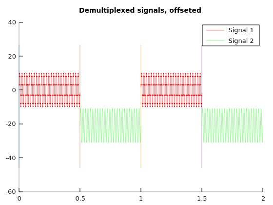

### Simulator configuration 2
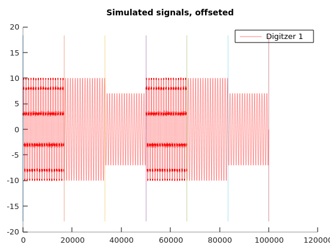
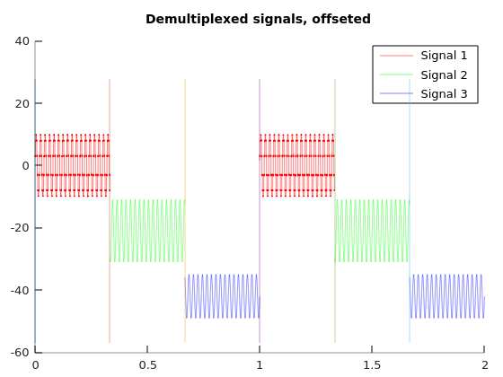

### Simulator configuration 3

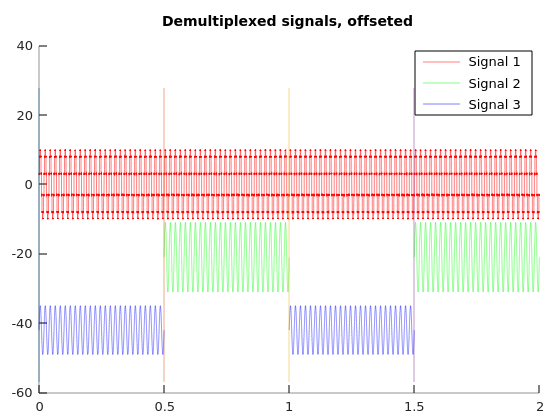

### Simulator configuration 4
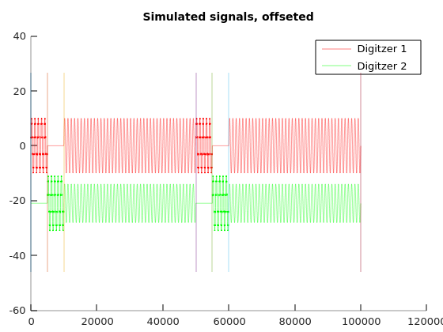
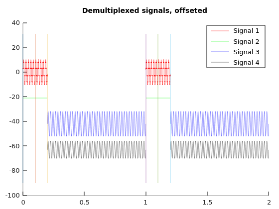

### Simulator configuration 5
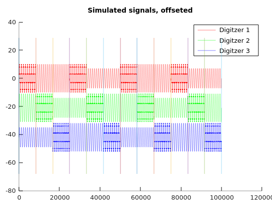
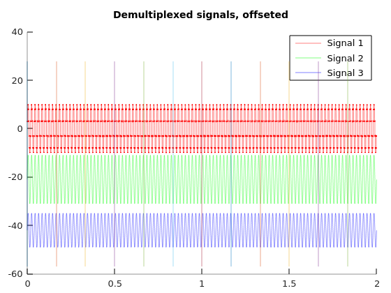

### Simulator configuration 6
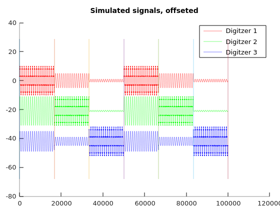
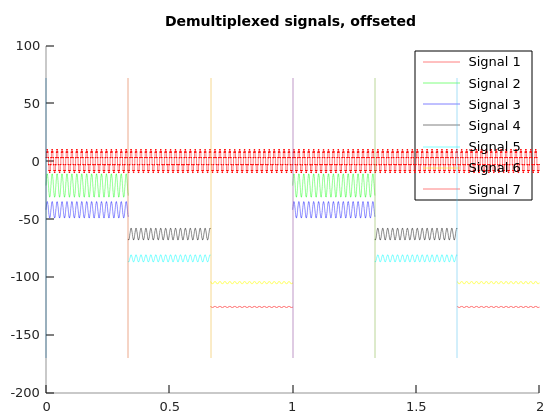
